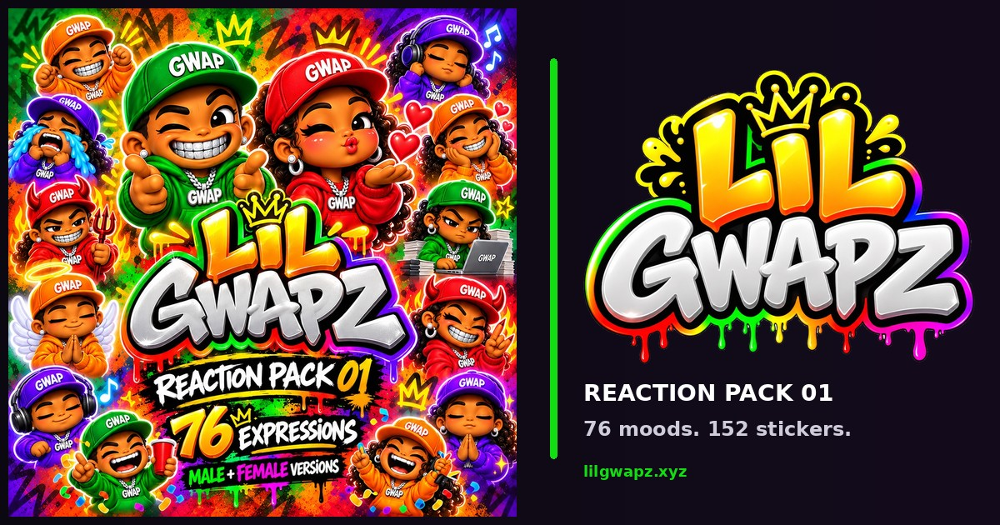

<p align="center">
  
</p>

<h1 align="center">Lil Gwapz</h1>

<p align="center"><strong>The official reaction-sticker universe created by Tha GwapSpot.</strong></p>

<p align="center">
  <a href="https://lilgwapz.xyz"><strong>Explore LilGwapz.xyz →</strong></a>
  &nbsp;·&nbsp;
  <a href="https://lilgwapz.xyz/browse.html">Browse all 152</a>
  &nbsp;·&nbsp;
  <a href="IP_POLICY.md">IP policy</a>
  &nbsp;·&nbsp;
  <a href="TERMS.md">Terms</a>
</p>

---

## What is Lil Gwapz?

**Lil Gwapz** is a standalone digital character and reaction-sticker brand from **Tha GwapSpot**. Reaction Pack 01 turns everyday online emotion into a distinct visual language built for messages, group chats, reactions and social sharing.

> **76 reactions × 2 distinct characters = 152 owner-approved stickers.**

The visual system is intentionally consistent: glossy 3D chibi street-cartoon styling, reaction-first poses, GWAP caps, silver jewelry and four core colorways — **Green, Orange, Red and Purple**.

| Collection | Scope |
| --- | --- |
| **Reaction Pack 01** | 76 core reactions |
| **Characters** | Male + Female Lil Gwapz |
| **Total stickers** | 152 transparent PNGs |
| **Export size** | 512 × 512 px |
| **Home** | [lilgwapz.xyz](https://lilgwapz.xyz) |
| **Creator / IP owner** | **Tha GwapSpot** |

## What this repository powers

This repository is the production source for the Lil Gwapz web experience and downloadable Reaction Pack 01 library. It includes:

- Mobile-first Lil Gwapz landing experience
- Searchable **152-sticker** gallery
- Mood, character and colorway filters
- Individual transparent PNG downloads
- Client-generated full-pack ZIP download
- Brand, favicon and social share-card assets
- [Approved app icon lock and export specifications](assets/brand/ICON_LOCK.md)
- Public Terms of Service, Privacy Policy and IP Usage Policy

## Brand ownership

**Lil Gwapz is proprietary intellectual property of Tha GwapSpot.** The characters, artwork, sticker designs, names, logos, visual identity, downloadable assets, site presentation and associated brand elements are protected works and are **not released as open-source creative assets** merely because this repository is public.

Personal reaction use and ordinary social sharing are permitted only under the limited license described in the [IP Usage Policy](IP_POLICY.md) and [Terms of Service](TERMS.md).

### Not permitted without written authorization

- Selling, sublicensing or repackaging Lil Gwapz assets
- Merchandise, print-on-demand goods or commercial product use
- NFT minting, tokenization or blockchain-based representations
- AI/model training, dataset ingestion, style cloning or automated derivative generation
- Creating competing sticker packs or derivative character systems from Lil Gwapz
- Using Lil Gwapz as a company mascot, logo, endorsement or advertising asset
- Redistributing the downloadable files as your own pack, archive or asset library

See the full [IP Usage Policy](IP_POLICY.md) for the enforceable project rules.

## Repository map

```text
.
├── index.html          # Main Lil Gwapz experience
├── browse.html         # Full 152-sticker gallery
├── app.js              # Gallery/search/download behavior
├── styles.css          # Shared visual system
├── stickers.json       # Canonical sticker metadata
├── assets/
│   ├── brand/          # Lil Gwapz brand assets
│   └── stickers/       # 152 approved transparent PNG exports
├── og/                 # Social share-card assets
├── terms.html          # Website Terms of Service
├── privacy.html        # Website Privacy Policy
├── ip-policy.html      # Website IP Usage Policy
├── TERMS.md            # Repository copy of Terms
├── PRIVACY.md          # Repository copy of Privacy Policy
├── IP_POLICY.md        # Repository copy of IP rules
└── LICENSE             # Proprietary / all-rights-reserved notice
```

## Run locally

Serve the repository root with any static web server:

```sh
python3 -m http.server 4173
```

Then open `http://localhost:4173`.

## Artwork and exports

`assets/stickers/` contains the **152 owner-approved 512 × 512 transparent PNG exports** from Reaction Pack 01. `stickers.json` maps each image to its reaction ID, label, variant, emoji, colorway and search keywords. The bulk download is assembled in the browser so each source asset only needs to exist once in the repository.

The separate GwapMojis collection is **not** used here. Lil Gwapz is its own standalone IP and product line.

## Legal

- [Terms of Service](TERMS.md)
- [Privacy Policy](PRIVACY.md)
- [Lil Gwapz IP Usage Policy](IP_POLICY.md)
- [Proprietary License / Copyright Notice](LICENSE)

**© 2026 Tha GwapSpot. Lil Gwapz and all related artwork, characters, marks and brand assets. All rights reserved.**

---

<p align="center"><strong>Made by Tha GwapSpot · Grind With A Purpose.</strong></p>
